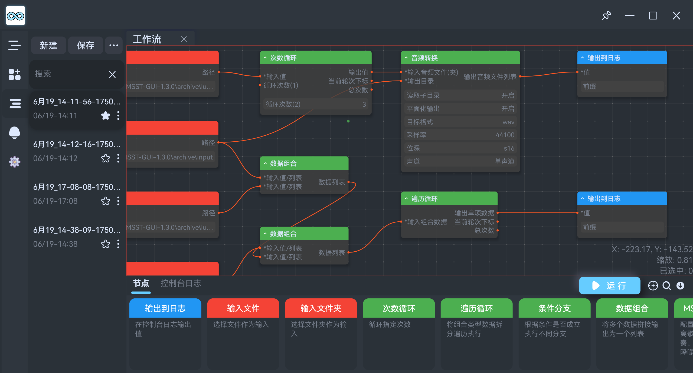
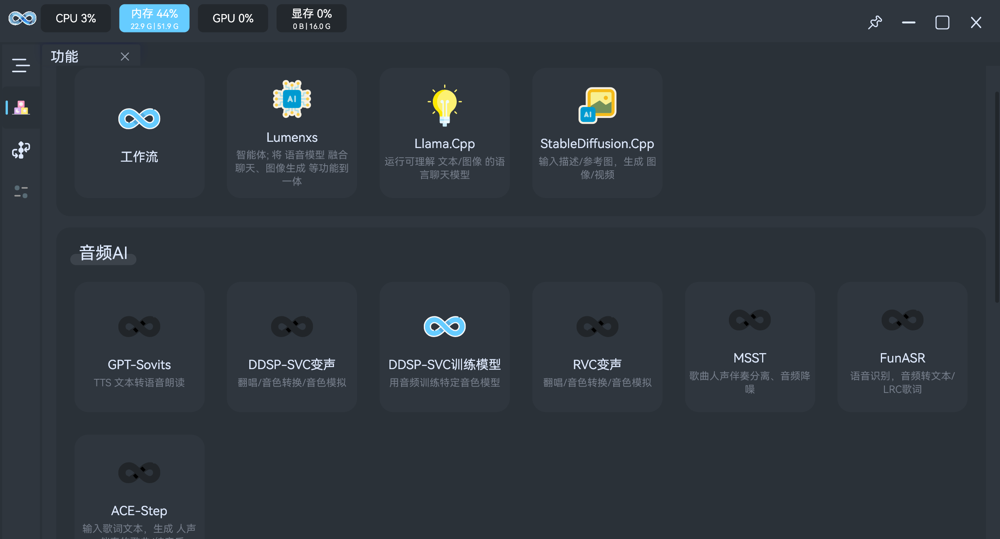
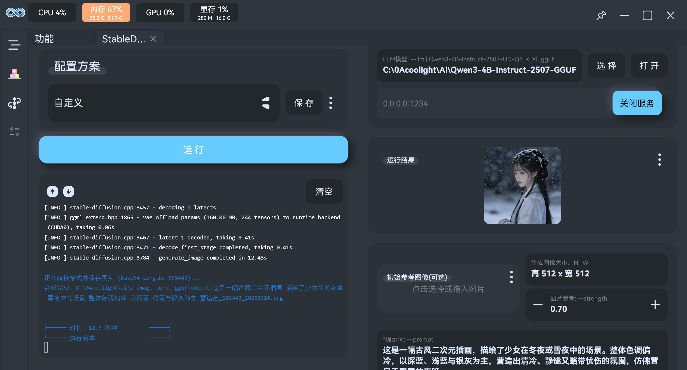
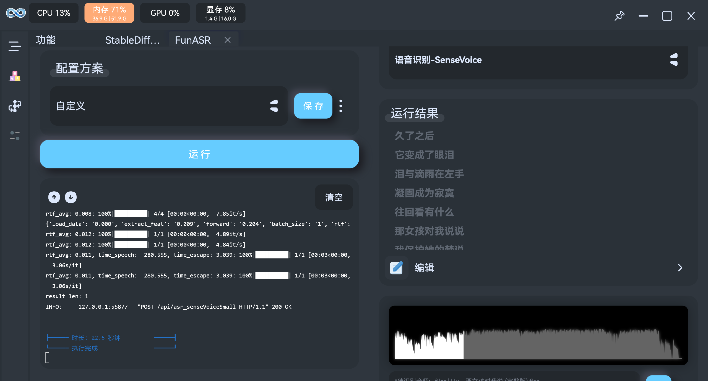

# Lumenxx 流明
* **！！！本项目目前正在测试开发基础功能中！！！**
* [官网/使用帮助](https://blog.lumenxx.bool.run/)
* [下载官网](https://download.lumenxx.bool.run/)
* [GitHub](https://github.com/coolight7/Lumenxx)

## 简介
- AI音视频简便处理工具。
- 支持[windows x64 win10或以上]
- 已经支持的模型：
  - 音频转换工具；转换格式、采样率、响度匹配、自动切片、移除静音
  - 文件工具；批量重命名、批量平铺移动
  - [Llama.cpp](https://github.com/ggml-org/llama.cpp)；本地运行 多模态语言模型
  - [StableDiffusion.cpp](https://github.com/leejet/stable-diffusion.cpp)；本地运行 文本/图像 生成 图片/视频
  - [DDSP-SVC](https://github.com/yxlllc/DDSP-SVC); AI变声翻唱
  - [RVC](https://github.com/RVC-Project/Retrieval-based-Voice-Conversion-WebUI) ; AI变声翻唱
  - [MSST](https://github.com/ZFTurbo/Music-Source-Separation-Training); 分离歌曲中的人声、伴奏、和声、混音、噪音
  - [GPT-SoVITS](https://github.com/RVC-Boss/GPT-SoVITS); TTS，文字转语音，声线克隆说话
  - [FunASR](https://github.com/modelscope/FunASR)；语音识别、自动歌词打轴
  - [ACE-Step](https://github.com/ace-step/ACE-Step); AI编曲/Remix
- 选择文件（夹）时自动推荐文件和目录路径
- Python环境自动插入额外的优化代码，检查运行环境、自动修复和警告提示

## 预览图
| -                                  | -                                  |
| ---------------------------------- | ---------------------------------- |
|  |  |
|  |  |

## 支持平台：
- windows (Win10及以上，x86_64)