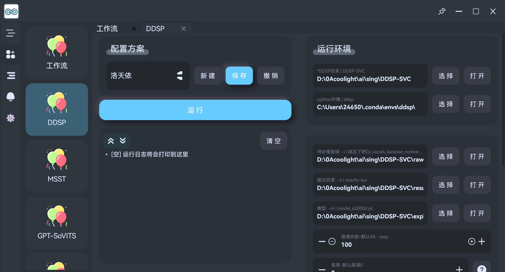
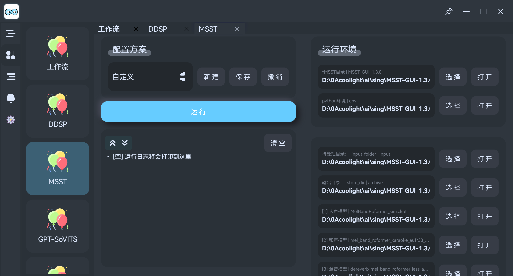
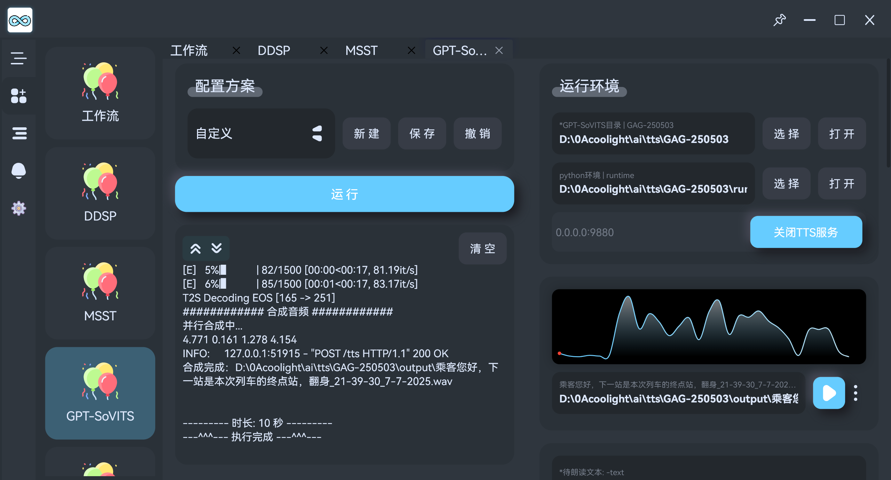

# Lumenxx 流明AI
* **！！！本项目目前正在测试开发基础功能中！！！**
* [官网/使用帮助](https://blog.lumenxx.bool.run/)
* [下载官网](https://download.lumenxx.bool.run/)
* [GitHub](https://github.com/coolight7/Lumenxx)

## 简介
- AI音视频简便处理工具，计划支持`独立运行模型`和`组合工作流`实现自动化。
- 支持[windows x64 win10或以上]
- 已经支持的模型：
  - 音频转换工具；包含转换格式、采样率、响度匹配、切片。
  - [DDSP-SVC](https://github.com/yxlllc/DDSP-SVC); AI变声翻唱
  - [RVC](https://github.com/RVC-Project/Retrieval-based-Voice-Conversion-WebUI) ; AI变声翻唱
  - [MSST](https://github.com/ZFTurbo/Music-Source-Separation-Training); 分离歌曲中的人声、伴奏、和声、混音、噪音
  - [GPT-SoVITS](https://github.com/RVC-Boss/GPT-SoVITS); TTS，文字转语音，声线克隆说话
  - [ACE-Step](https://github.com/ace-step/ACE-Step); AI编曲/Remix

## 使用帮助
- [点击前往 GPT-SoVITS 使用帮助Bili视频、下载整合包、模型包](https://www.bilibili.com/video/BV1LAbDzsEUz/?spm_id_from=333.1387.homepage.video_card.click)

## 预览图
| -                                  | -                                  | -                                  | -                                  |
| ---------------------------------- | ---------------------------------- | ---------------------------------- | ---------------------------------- |
|  |  |  |  |

## 支持平台：
- windows (Win10及以上，x86_64)