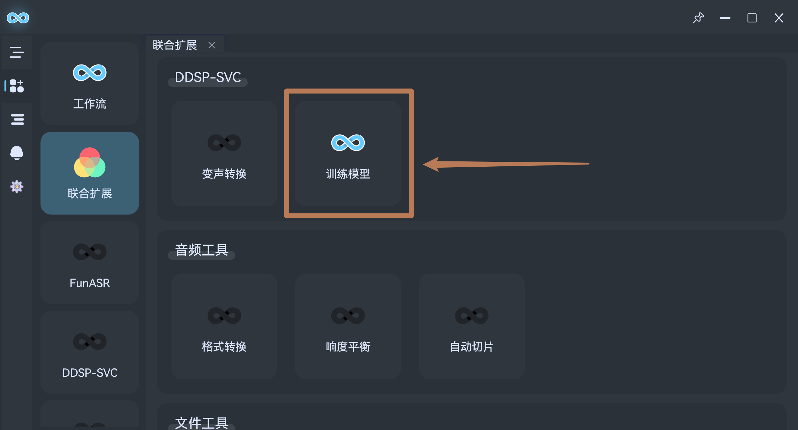
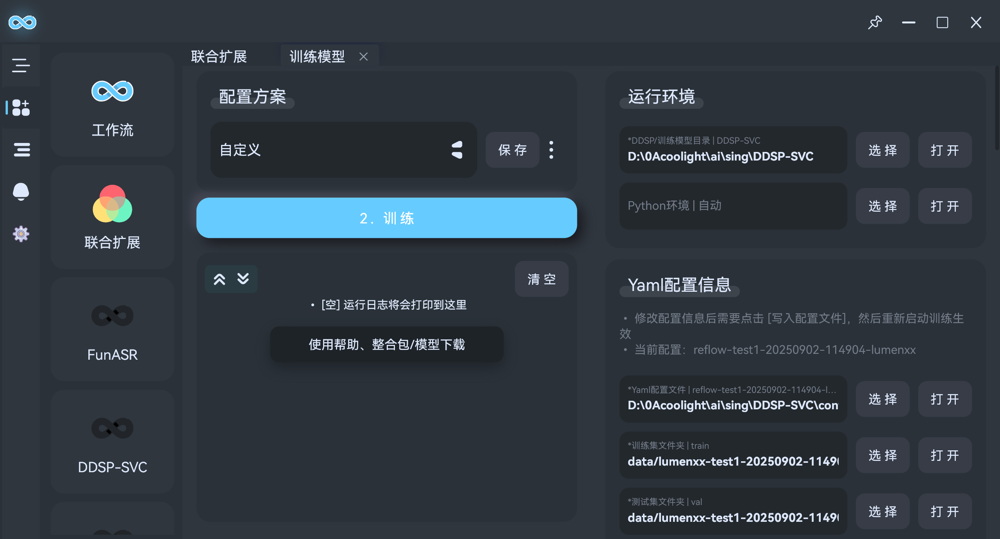
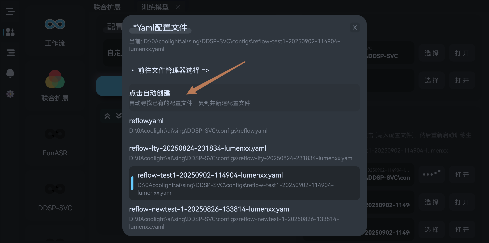
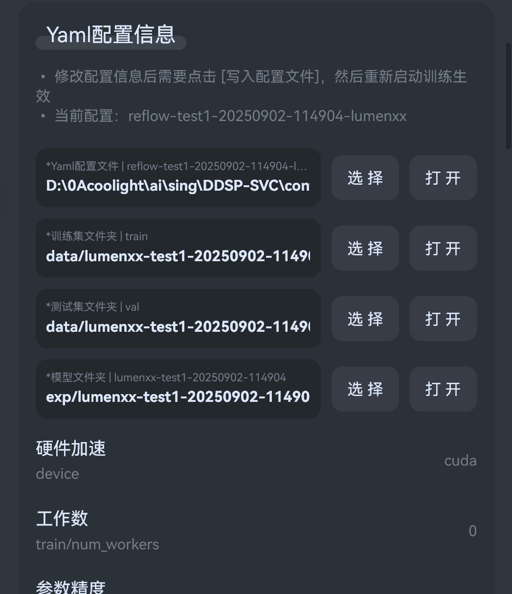
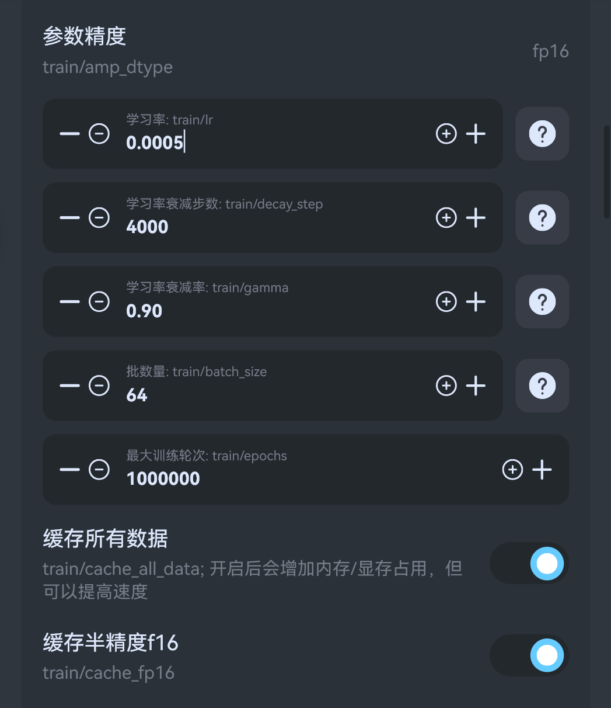
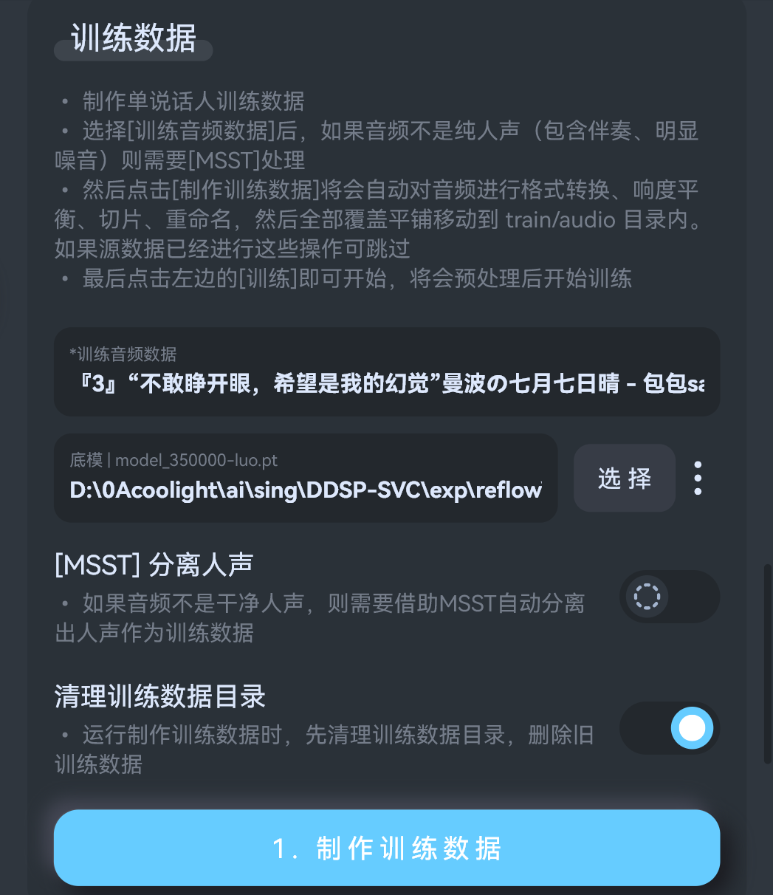
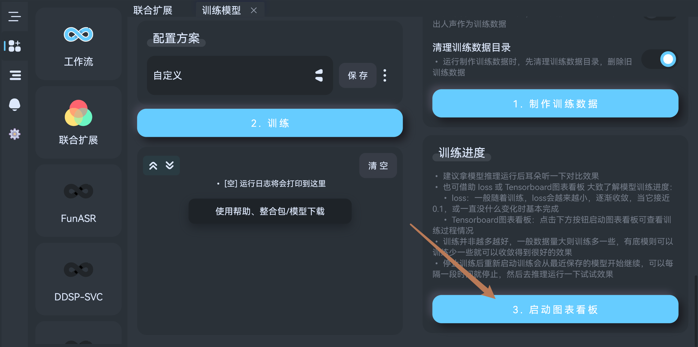

# DDSP-SVC 模型训练
- [DDSP-SVC](https://github.com/yxlllc/DDSP-SVC) AI变声/翻唱

## 前言
- 训练模型需要音频素材，就是将音频素材喂给算法训练，得到一个对应音色的模型
- 一般模型质量由训练数据和算法决定，训练数据的质量会极大影响模型质量！折腾训练时长、步数都远不如提升训练数据质量

## 准备
- 首先收集你想要的音色的音频数据，一般在1个小时左右就可以了，对于DDSP来说，10分钟也能玩，但数据越多、质量越高，最终效果越好。
- 训练单人模型一定要单音色的音频数据！比如有些声优配音，不同角色差别大就不能混一起训练了，不然练出来的模型一般不是混合了音色，而是交替出现，听起来就像部队点人数时不同人音色喊 1、2、3、4、5 一样
- 最好有显卡支持，靠CPU会慢非常多
- 需要提取为纯人声音频，可以用[MSST](/help/plugins/msst/)分离出人声，如果有明显噪音的音频也可以用`MSST`处理；游戏语音一般不用，它本身比较纯净，经过分离和降噪反而可能削掉部分音频和音质。

## 流明AI一键训练
- 启动`流明`，然后在插件中安装`DDSP-SVC`
- 回到主页，点击`联合扩展`-`DDSP-SVC`-`训练模型`:

- 右上角`运行环境`，点击选择`DDSP目录`:

- 然后在下方的`Yaml配置信息`中，选择配置文件，新训练模型的话可以点击`自动复制创建`:

- 然后来调一下参数：
  - `训练集文件夹`: 生成的训练数据的存放目录
  - `测试集文件夹`: 生成的测试数据存放目录
  - `模型文件夹`: 训练过程和最终生成的模型存放目录
  - `硬件加速`: 如果有N卡，可以选择`cuda`提高训练速度
  - `工作数`: 如果cpu和显卡都比较强，可以选择`0`提高速度

- o
  - `参数精度`: 降低精度可提升速度，但也会略微降低质量
  - `学习率`: 和模型质量密切相关，没有基于其他模型，或是基于0步底模训练则选择默认`0.0005`即可，否则在选择底模时，流明会自动计算推荐
  - `批数量`: 调大可以提高训练速度，但会增加显存占用
  - `最大训练轮次`: 训练到该轮次时停止，建议往大了调，正常应当手动停止，等训练到这个轮次限制太多了

### 1. 制作训练数据
- 将之前准备好的纯人声音频拖入`训练音频数据`框中，然后选择一个底模，就是基于什么模型进一步训练，建议选择整合包内的0步底模。
- 底模可不选，但无底模需要训练非常久才能出效果，有底模一般1w左右就能听了，无底模可能需要10w开始才会底噪少。
- 然后点击制作

### 2. 开始训练
- 点击左边的训练按钮即可开始，流明会自动执行`数据预处理`-`训练`
- 训练中途可以停止，下一次训练会从上一次保存的步数开始，默认是2000步保存一次，建议每1w步停止一下，然后去运行听一下效果。
- 并不是训练越多越好，训练太多模型反而会学到训练数据里的噪音等。
- 一般 loss 接近 0.1，或是训练比较久没怎么变化了就可以了
- 还可以用图表大致判断，但最好的方式是自己听一下，有些小缺点反而才是独特的，可能也会是自己喜欢的。

### 训练进度图表
- 右边底下可以启动图表：
