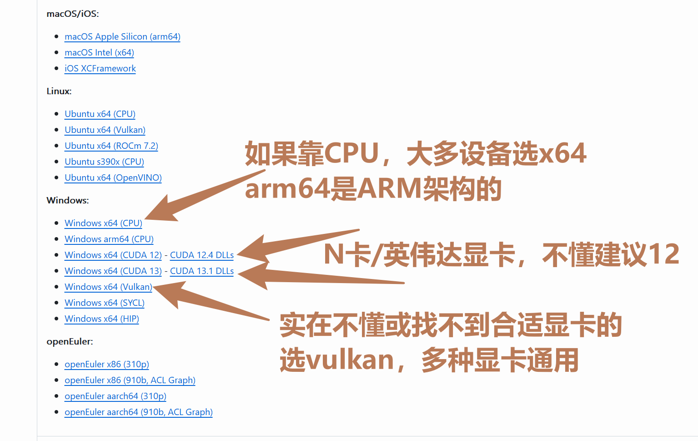
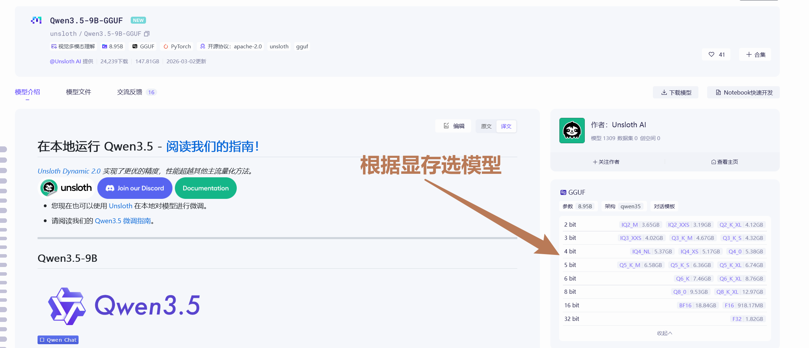
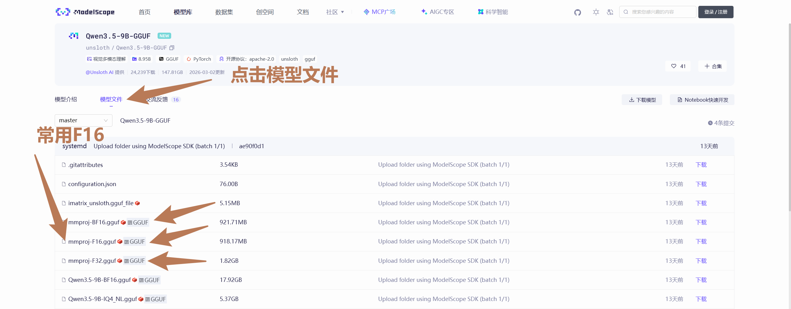
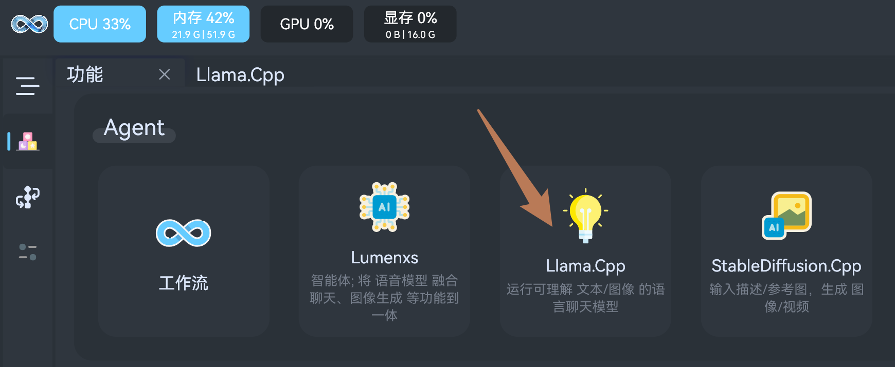
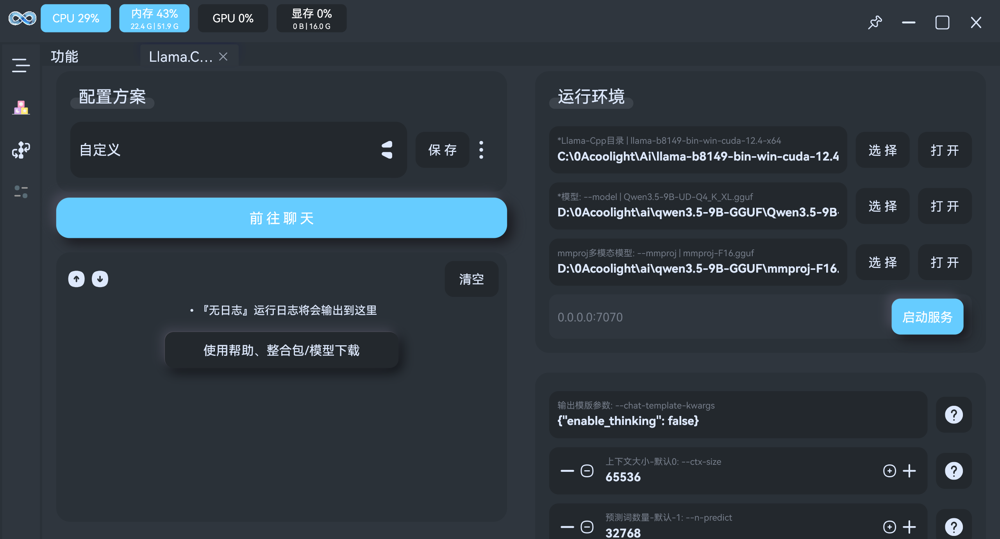

# Llama.cpp 使用帮助
- [Llama.cpp](https://github.com/ggml-org/llama.cpp): 用于运行语言聊天模型，可理解文本/音视频

## 如何使用
1. 挂VPN，[点击前往Github下载运行环境](https://github.com/ggml-org/llama.cpp/releases)
  - 从下载页面中选择适合自己的显卡或CPU的压缩包下载，其中`windows`系统需要选择`win`字段的
    - 带`cuda`字段的表示适用于`N卡、英伟达显卡`设备
    - 带`vulkan`字段的表示适用于多种显卡设备，如果你明确知道自己是`N卡或AMD显卡`则选择`cuda/rocm`，不然就无脑下载`vulkan`
    - 其他的就是没有显卡加速的，只靠`CPU`跑，相比有上述有显卡加速的会慢很多
  - Llama.cpp 经常更新，会逐步添加新的显卡/CPU/AI模型的支持和优化，后续新模型无法运行时可尝试到`下载页面`更新下载

2. 下载模型，Llama.cpp需要GGUF格式的模型文件，国内建议复制想要的模型名称到[魔搭社区](https://www.modelscope.cn/models)搜索下载
   - 这里以`Qwen3.5-9B`为例，它需要`主体模型`+`mmproj模型`两部分，如果不需要AI支持理解图片，可以只下载`主体模型`
   - 首先是`主体模型`: 根据你的显卡的显存大小挑选模型，一般选`显存容量减2G`大小的模型，普遍规律是模型越大，效果越好，但越吃显存、运行越久，只要显存放得下，优先选尽可能大的追求质量，当然也可以选`4bit量化`之类的追求速度。我的话常用的就是`4Bit`量化，效果够用兼顾速度

   - 然后是`mmproj模型`，建议选`F16`即可

3. 启动`流明`运行模型，点击`Llama.Cpp`

4. 填入文件路径即可:
   - `Llama-Cpp目录`，选择下载的 运行环境压缩包zip`解压后的目录`
   - `模型`，选择`qwen3.5-9B的主体模型`路径
   - `mmproj多模态模型`，可选，如果主体模型支持多模态，可添加选择对应的mmproj文件

5. 点击`启动服务`
6. 点击左边的`前往聊天`即可

## 一键整合包
- 待发布

## 模型分享
- 模型仅供学习参考，投入使用时注意版权等问题。
  - 很多他人分享的模型，不是我们训练的，模型质量和使用需留意其说明
  - [魔搭社区](https://www.modelscope.cn/models)