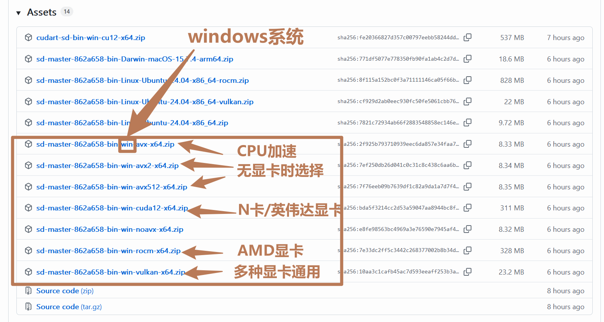
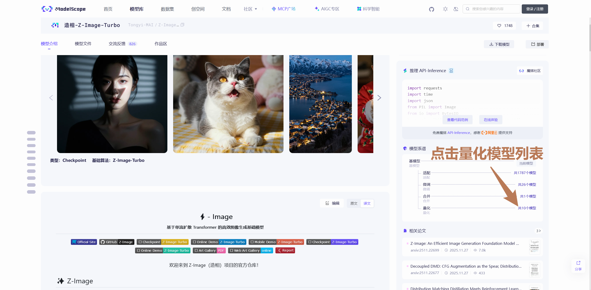
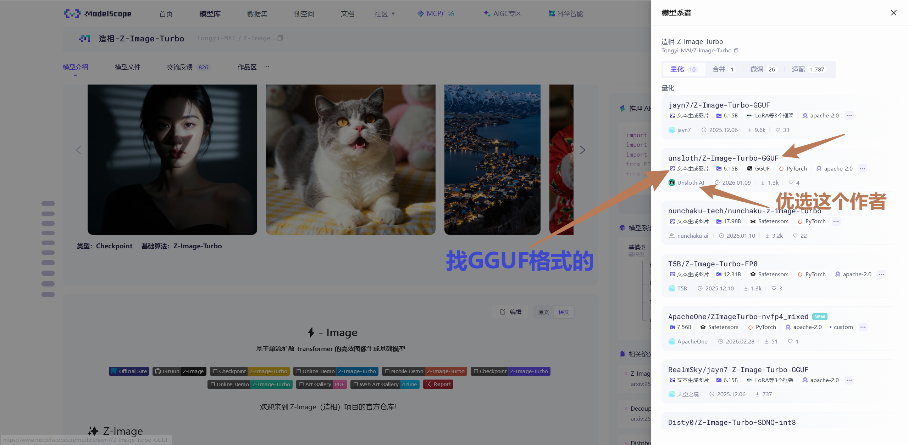
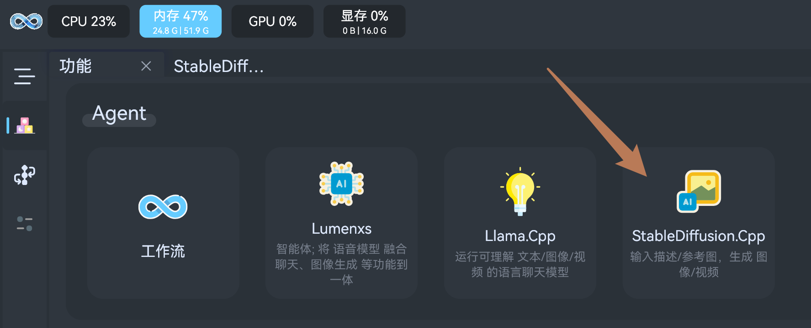
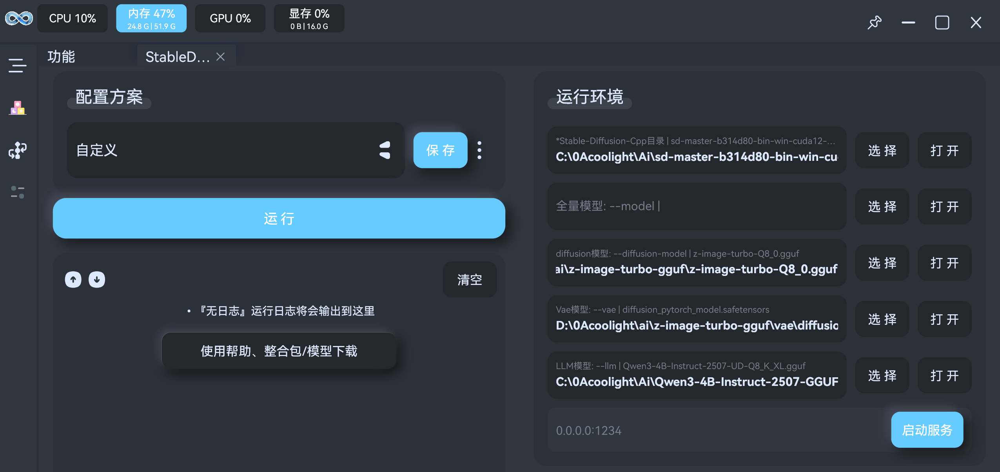
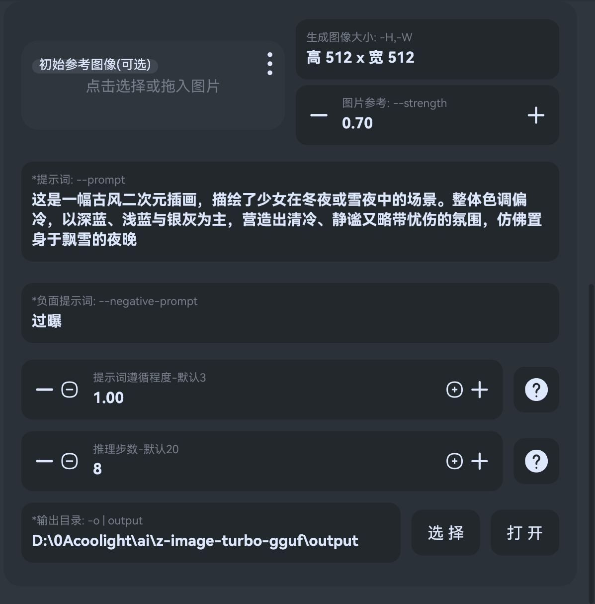

# StableDiffusion.cpp 使用帮助
- [StableDiffusion.cpp](https://github.com/leejet/stable-diffusion.cpp): 用于运行AI模型生成 图片/视频

## 如何使用
1. 挂VPN，[点击前往Github下载运行环境](https://github.com/leejet/stable-diffusion.cpp/releases)
  - 从下载页面中选择适合自己的显卡或CPU的压缩包下载，其中`windows`系统需要选择`win`字段的
    - 带`cuda`字段的表示适用于`N卡、英伟达显卡`设备
    - 带`rocm`字段的表示适用于`AMD显卡`设备
    - 带`vulkan`字段的表示适用于多种显卡设备，如果你明确知道自己是`N卡或AMD显卡`则选择`cuda/rocm`，不然就无脑下载`vulkan`
    - 其他的就是没有显卡加速的，只靠`CPU`跑，相比有上述有显卡加速的会慢很多
  - sd.cpp 经常更新，会逐步添加新的显卡/CPU/AI模型的支持和优化，后续新模型无法运行时可尝试到`下载页面`更新下载

2. 下载模型，从[SD.cpp的README.md](https://github.com/leejet/stable-diffusion.cpp/blob/master/README.md#features)可以看到支持的模型列表，对应的模型所需文件见[SD.cpp模型说明列表](https://github.com/leejet/stable-diffusion.cpp/tree/master/docs)，国内建议复制想要的模型名称到[魔搭社区](https://www.modelscope.cn/models)搜索下载
   - 这里以`Z-Image-turbo`为例，它需要`主体模型`+`VAE模型`+`LLM模型`三部分
   - 首先是`主体模型`
    
       - 来到[Z-Image-Turbo介绍](https://www.modelscope.cn/models/Tongyi-MAI/Z-Image-Turbo)，可以发现右边有模型列表，由于官方提供的是safetensors格式，我们优先GGUF格式的模型，可以点击右边的`量化模型列表`：
    
       - 优先选择`Unsloth AI`上传的`GGUF`，[点击直达](https://www.modelscope.cn/models/unsloth/Z-Image-Turbo-GGUF)：
    
       - 根据你的显卡的显存大小挑选模型，一般选`显存容量减1G`大小的模型，普遍规律是模型越大，效果越好，但越吃显存、运行越久，只要显存放得下，优先选尽可能大的追求质量，当然也可以选`4bit量化`之类的追求速度
    
   - 然后是`VAE模型`，新建一个`vae`文件夹，然后[点击下载](https://huggingface.co/black-forest-labs/FLUX.1-schnell/tree/main/vae)两个文件到`vae`文件夹中
   - 最后是`LLM模型`，这里需要一个`Qwen3-4B`，[点击前往下载](https://www.modelscope.cn/models/unsloth/Qwen3.5-4B-GGUF)一个模型即可
3. 启动`流明`运行模型，点击`StableDiffusion.Cpp`

   - 然后把刚刚下载的各种文件路径填入即可:
     - `Stable-Diffusion-Cpp目录`，选择下载的 运行环境压缩包zip`解压后的目录`
     - `diffusion模型`，选择`z-image-turbo 主体模型`路径
     - `Vae模型`，选择`vae模型`路径
     - `LLM模型`，选择`qwen3-4B`路径

4. 点击`启动服务`
5. 参数说明，部分参数名带\*表示`必须选择`，未带\*即为可选：
   - `初始参考图像`；基于参考图像生成新图像
   - `图片参考`；初始图像参考程度，取值 [0, 1.0]，值越大，重绘幅度越小，跟原图越相似
   - `生成图像大小`；
   - `提示词`；描述想要生成的图像
   - `负面提示词`；这里输入的词语影响AI避免生成的图像
   - `提示词准寻程度`；控制提示词对生成图像的影响强度，数值越高，AI 越严格遵守提示词；数值越低，AI 越自由
   - `推理步数`；步数越大，生成的图片越精细，但运行时间也将随线性增加

## 一键整合包
- 待发布

## 模型分享
- 模型仅供学习参考，投入使用时注意版权等问题。
  - 很多他人分享的模型，不是我们训练的，模型质量和使用需留意其说明
  - [魔搭社区](https://www.modelscope.cn/models)